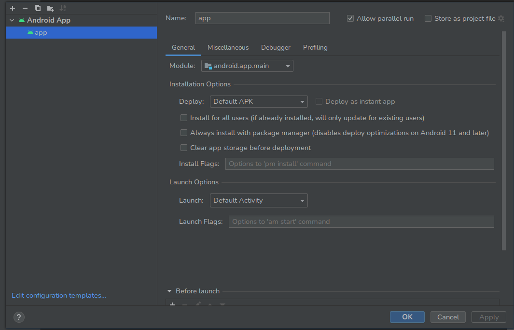

# Developers environment
VS-Code
Node- v16.13.0
Ionic(installed globally)- 7.2.0
Linux-6.6.11-1-lts(Arch linux distro)
# Host device 
Phone itself- Xiaomi Poco X3 NFC
MIUI version- MIUI GLobal 12.5.8 
Storage- around 40 Gb remaining 
Android - 11 RKQ1.200826.002
# Steps used 
1º ionic start minimalVue --type vue
	|> Blank
	|> No new Account 
2º Create Readme
3º npm install @capacitor/android
4º npx cap add android
5º npm install @capacitor-mlkit/barcode-scanning
6º npx ionic cap sync
7º Commit+ Publish this repo("Pilot" hash: d43743c791cb623fb19a463984b4dde9405aa95a)
8º paste below into app/src/main/AndroidManifest.xml (above application)
```xml
<!-- To get access to the camera. -->
<uses-permission android:name="android.permission.CAMERA" />
<!-- To get access to the flashlight. -->
<uses-permission android:name="android.permission.FLASHLIGHT"/>
```
9º paste below into the aformentioned markup file but inside the application tag(above any other children tags)
```xml
<meta-data android:name="com.google.mlkit.vision.DEPENDENCIES" android:value="barcode_ui"/>
```
10º used np run dev to check if everything was ok
11º added logic for barcode scanner
12º npx ionic cap open android
|> trust project
|> close tips
|> selected project tab instead of android on the upper left area
13º verified the configuration

#14º connect my device 
#15º selected the second option for file transfer(instead of the weird gallery option that i supposed its for mtp stuff)
|> btw the phone has already been set up for programer mode and i've launched successfully various hybrid apps on it
16º on android studio selected my device labelled Xiaomi(some kind of URI/model i presume)
17º Build
18º Blast it by running it
19º nothing happened... i forgot to do stuff before, so npx ionic cap sync
#20º Odd different error claiming i havent installed mlkit from google on android debugger
21º changed developer version to java-17-openjdk to be able to run npx ionic cap run android
22º pasted bellow, above the camera permission
<uses-feature
        android:name="android.hardware.camera"
        android:required="false" />
23º Error: The Google Barcode Scanner Module is not available. You must install it first